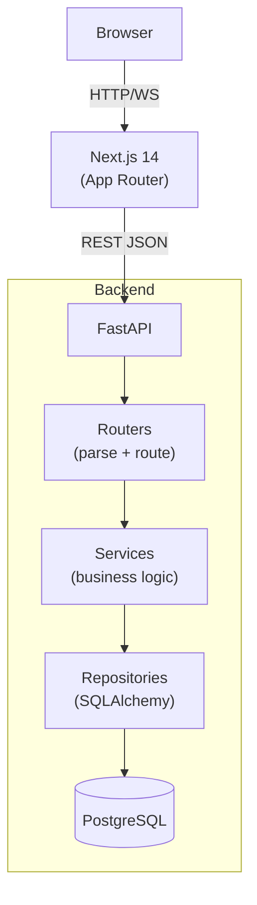
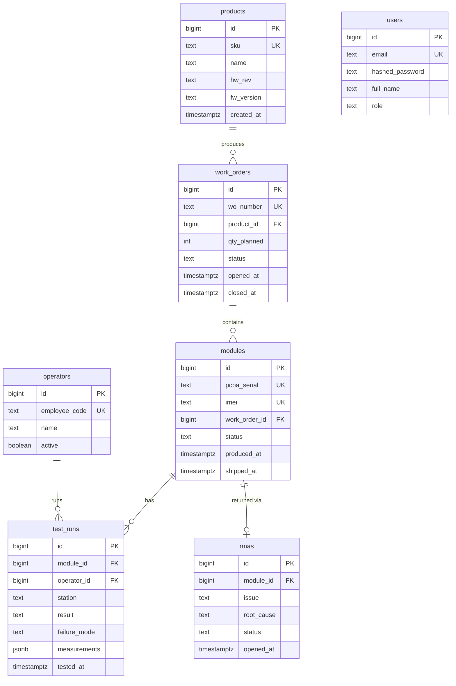

# ModuleTrace

Manufacturing quality traceability platform for cellular IoT modules — tracks every unit from PCB assembly through functional test, field deployment, and RMA.

## What it does

ModuleTrace gives manufacturing engineers a single source of truth for every hardware module on the line. A unit's PCBA serial and IMEI are linked at flash time; every AOI and FCT result is attached to that unit, so yield analytics and failure Pareto charts update in real time. Operators scan boards on a tablet to submit pass/fail results with a single tap. Engineers query any serial or IMEI to see its full build history. Quality engineers open and track RMAs without leaving the same interface.

## Tech stack

- **FastAPI** — async REST API
- **PostgreSQL 16** — primary data store
- **SQLAlchemy 2.0** — async ORM with `Mapped`/`mapped_column`
- **Alembic** — schema migrations
- **Pydantic v2** — request/response validation
- **Next.js 14** — App Router frontend
- **TanStack Query v5** — data fetching and cache
- **Recharts** — FPY bar chart
- **Docker + Docker Compose** — local dev and deployment

## Architecture



## Database schema



## Running locally

**Prerequisites:** Docker and Docker Compose

```bash
git clone <repo-url>
cd moduletrace

cp .env.example .env
# .env is pre-configured for the Docker Compose postgres service

docker compose up --build

# In a separate terminal, run migrations and seed data
docker compose exec api alembic upgrade head
docker compose exec api python scripts/seed.py
```

Then open:

- `http://localhost:3000` — frontend
- `http://localhost:8000/docs` — Swagger UI

**Demo credentials:**

| Role     | Email                  | Password   |
|----------|------------------------|------------|
| Operator | operator@ew.com        | demo1234   |
| Engineer | engineer@ew.com        | demo1234   |
| Quality  | quality@ew.com         | demo1234   |

## Running tests

```bash
cd backend
pip install -e ".[dev]"
pytest -v
```

Tests use an in-memory SQLite database via `aiosqlite` — no Postgres required.

## Key design decisions

- **Routes → Services → Repositories**: each layer has one responsibility. Routes parse HTTP; services own business rules and transactions; repositories own SQLAlchemy queries. This makes the service layer independently testable and keeps query logic out of route handlers.

- **Separate request and response schemas**: `TestRunCreate` accepts the operator's POST payload; `TestRunResponse` controls what the API returns. Decoupling them lets the DB schema evolve without changing the public API contract.

- **Explicit transactions in test-run creation**: posting a test run updates two tables — `test_runs` and `modules.status`. Wrapping both writes in a single transaction prevents partial updates if the service fails mid-operation.

- **Partial indexes on `test_runs`**: `failure_mode` and the IMEI column on `modules` are indexed only where non-null (`postgresql_where`). Most rows have null failure modes; the partial index stays small and fast for Pareto queries.

- **`ERPClient` as a `Protocol`**: the ERP integration is defined as a structural interface rather than an abstract class, so `MockERPClient` and any future real client are drop-in replacements with no inheritance required — easier to swap in tests and in production.
